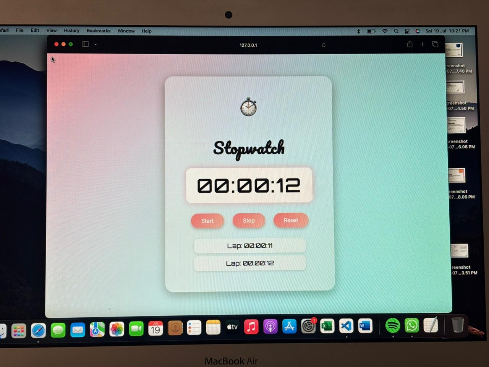

# ⏱️ Cute Aesthetic Stopwatch

A beautifully designed **digital stopwatch** built with **HTML, CSS, and JavaScript**.  
It features a **cute pastel gradient theme**, smooth animations, and lap recording functionality.

---

## ✨ Features
- **Start, Stop, and Reset** functionality.
- **Lap recording** (saves the time when the stopwatch is stopped).
- **Cute pastel theme** with glowing digital display.
- **Glassmorphism UI** (blurred, semi-transparent container).
- **Animated icon and hover effects** on buttons.
- **Responsive design** – works on mobile and desktop.

---

## 🖼️ Preview
> **Ensure your screenshot image file is placed in the project root as `stopwatch.jpeg`.**  



---

---

##Project Structure


cute-stopwatch/
├─ index.html
├─ style.css
├─ script.js
├─ stopwatch.jpeg        
└─ README.md
```

---

## 🛠️ Technologies Used
- **HTML** – Structure of the stopwatch.
- **CSS** – Styling, pastel gradients, and animations.
- **JavaScript** – Stopwatch logic (start, stop, reset, laps).


```markdown

```

---

## 🏗️ Future Enhancements
- Add **milliseconds** for precision.
- Add a **Lap** button (manual lap capture) separate from Stop.
- Add **dark/light mode toggle**.
- Add **animated pastel bubbles** in the background for extra cuteness.
- Export **lap times as CSV**.

---


